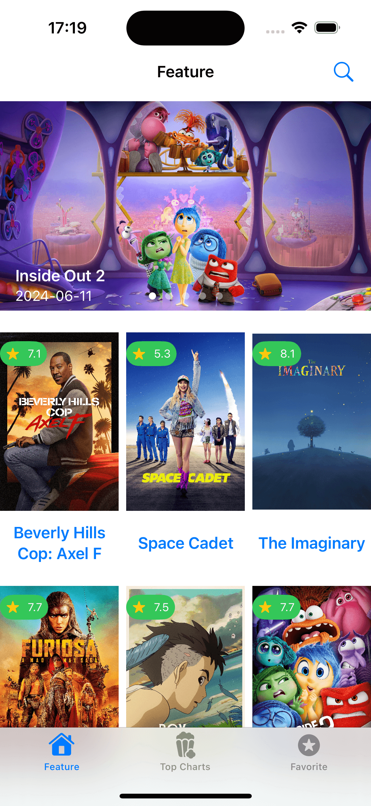
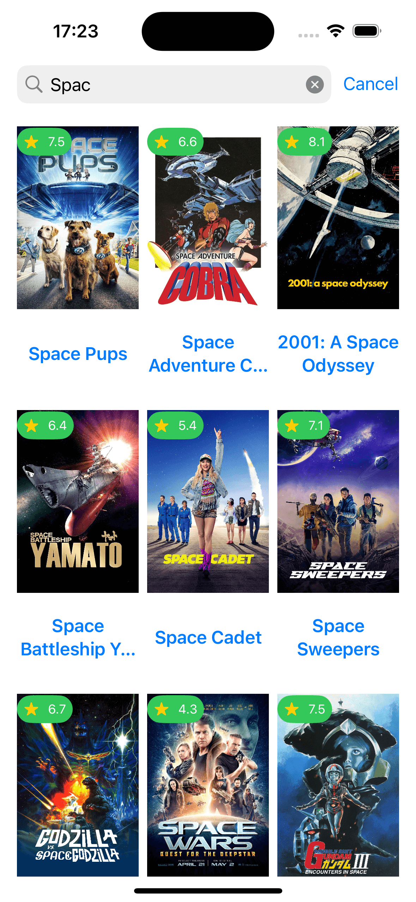
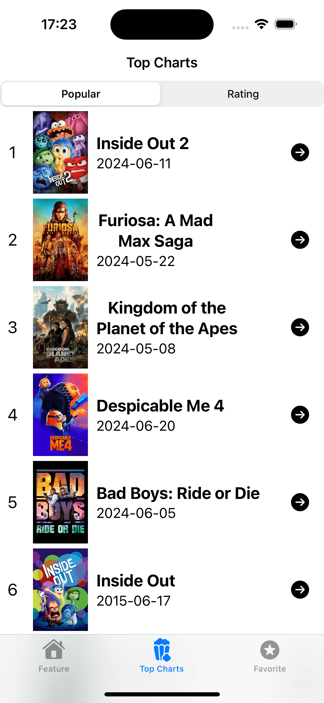
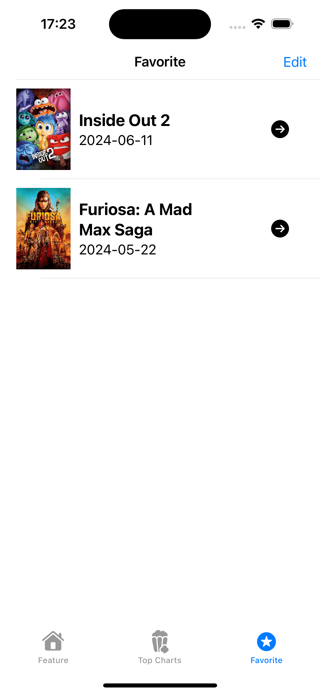
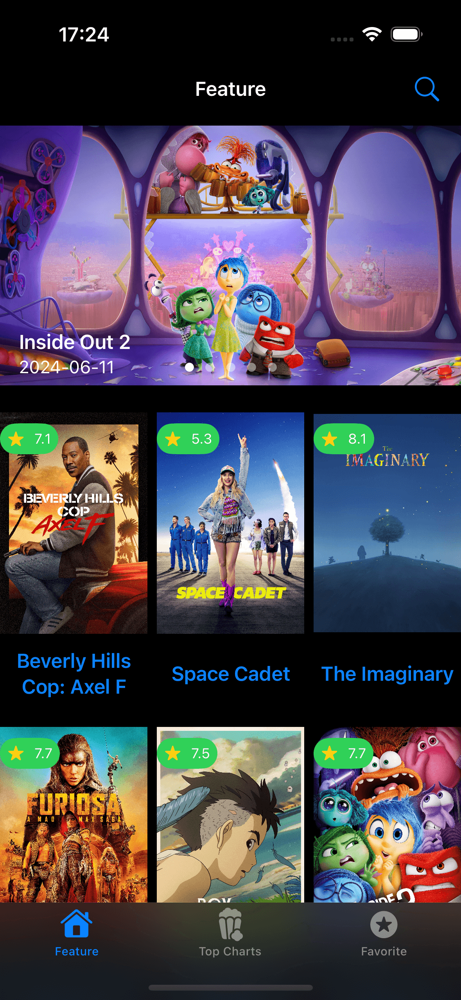

# MovieDB-SwiftUI-App

MovieDB App made in SwiftUI.

Xcode >=15 and iOS >= 17 required.

## Features

- ⭐ Featured movie list (with rating)
- 🔥 Popular/Top rated movie ranking
- 🔍 Search movie by keyword
- 🎥 Movie detail
- ✅ Making Your favorite list (by iOS CoreData)
- 🌙 Dark mode

## Screenshots

<p>
  
  
  
  
  
</p>

## Installation

### 1. Open Xcode App

```shell
open MovieDB-SwiftUI-App.xcodeproj
```

### 2. Set MovieDB token

First of all, register your MovieDB account and get MovieDB token in MovieDB developer site.
How to get your MovieDB is [here](https://developer.themoviedb.org/docs/getting-started).

In Xcode, open `Edit Scheme` > `Run` > `Environment Variables`.
You can change `MOVIE_TOKEN` variable into your MovieDB token.
